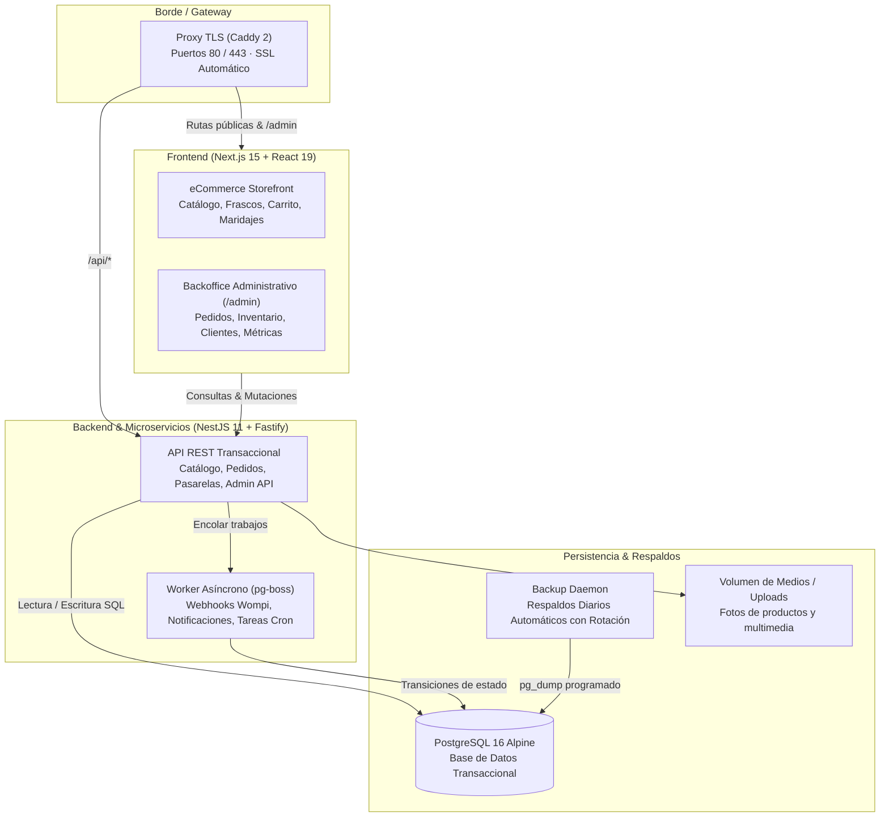

# Pimentones La Cajita · Plataforma de Comercio Electrónico y Administración

Plataforma integral de comercio electrónico y backoffice administrativo para **Pimentones La Cajita** (conservas artesanales en Bogotá, Colombia).

Estructurada como un **monorepo modular desacoplado** con contenedores y microservicios independientes para la tienda pública, el panel administrativo, la API transaccional, el procesamiento asíncrono y la persistencia de datos.

---

## 🏛️ Arquitectura de Microservicios y Contenedores



### Tabla de Microservicios y Contenedores

| Servicio / Contenedor | Tipo | Responsabilidad | Puerto | Salud / Healthcheck |
|---|---|---|---|---|
| **`proxy`** | API Gateway & TLS | Terminación SSL/TLS automática, compresión HTTP/3 y enrutamiento inverso hacia frontend y backend. | `80`, `443` | Proxy Caddy activo |
| **`web` (eCommerce)** | Frontend Tienda | Tienda pública ultrarrápida: selector de sabores, caja de madera interactiva, maridajes, asistente de cocina y pasarela de pago. | `3000` | `GET /` (HTTP 200) |
| **`web` (Backoffice)** | Frontend Admin | Panel privado en `/admin`: control de pedidos, inventario por lotes, cupones, zonas de envío, CRM de clientes y auditoría. | `3000` (`/admin`) | Protegido con Guards y JWT |
| **`api`** | Backend Core | Núcleo transaccional en NestJS 11 + Drizzle ORM: cálculo de envíos, firma de integridad Wompi, cotización y gestión de órdenes. | `4000` | `GET /api/health` |
| **`worker`** | Worker Asíncrono | Mismo binario que la API (`node dist/worker.js`). Procesa colas de correo SMTP, webhooks de pagos y expiración de pedidos pendientes. | Interno | `GET :4001/health` |
| **`db`** | Base de Datos | Motor relacional PostgreSQL 16 con índices optimizados y transacciones ACID. | `5432` | `pg_isready -U lacajita` |
| **`backup`** | Respaldo y DR | Demonio programado para realizar volcados `pg_dump` con compresión `.dump.gz` y retención configurable. | — | Cron diario |

---

## 🚀 Inicio Rápido en Desarrollo Local

### Requisitos previos
- Node.js 22+
- Docker Desktop
- Git

### 1. Clonar y configurar variables de entorno
```bash
git clone https://github.com/hernan-Saroa/Pimentones_La_Cajita.git
cd Pimentones_La_Cajita

# Configurar variables locales
cp apps/api/.env.example apps/api/.env
cp apps/web/.env.example apps/web/.env.local
```

### 2. Levantar con Docker o Node.js

#### Opción A · Desarrollo con Docker Compose (Recomendado):
```bash
docker compose -f docker-compose.dev.yml up
```

#### Opción B · Desarrollo híbrido (Base de datos en Docker + Apps locales):
```bash
# Iniciar PostgreSQL en Docker
docker compose -f docker-compose.dev.yml up db -d

# Instalar dependencias y compilar contratos compartidos
npm install
npm run build -w packages/shared

# Iniciar backend y frontend en paralelo
npm run dev
```

URLs disponibles:
- **eCommerce Tienda:** [http://localhost:3000](http://localhost:3000)
- **Backoffice Administrativo:** [http://localhost:3000/admin](http://localhost:3000/admin)
- **Documentación Swagger API:** [http://localhost:4000/api/docs](http://localhost:4000/api/docs)
- **Healthcheck API:** [http://localhost:4000/api/health](http://localhost:4000/api/health)

---

## 📦 Despliegue en Producción con Docker

El proyecto incluye orquestación lista para producción en [docker-compose.yml](docker-compose.yml) y comandos automatizados con `make`:

```bash
# 1. Configurar variables de producción
cp .env.example .env
cp apps/api/.env.example apps/api/.env

# 2. Levantar el stack completo
make up

# 3. Validar estado y salud de los contenedores
make ps
make smoke URL=https://www.pimentoneslacajita.com

# 4. Despliegues continuos sin tiempo de inactividad
make deploy TAG=<commit-sha>

# 5. Respaldos manuales o programados
make backup
make restore F=backups/archivo.dump.gz
```

---

## 🛠️ Estructura del Monorepo

```
├── apps/
│   ├── api/                 # Microservicio Backend (NestJS 11, Fastify, Drizzle ORM, Worker)
│   │   ├── Dockerfile       # Imagen optimizada multi-stage con usuario no root
│   │   └── src/             # Módulos: auth, catalog, orders, payments, admin, jobs, health
│   └── web/                 # Frontend eCommerce y Backoffice (Next.js 15, React 19)
│       ├── Dockerfile       # Standalone production container
│       ├── app/             # Rutas públicas (tienda, checkout, tracking) y /admin
│       └── components/      # Componentes UI de diseño World-Class
├── packages/
│   └── shared/              # Contratos de datos, Zod schemas, tipos TypeScript y utilidades
├── infra/
│   ├── caddy/               # Configuración del Gateway Caddyfile con HTTPS automático
│   └── backup/              # Scripts de respaldo y rotación de copias de seguridad
├── docs/                    # Documentación de arquitectura, backlog y despliegue
├── docker-compose.yml       # Orquestador de producción (6 servicios)
├── docker-compose.dev.yml   # Orquestador de desarrollo con hot-reloading
└── Makefile                 # Atajos de operaciones y mantenimiento
```

---

## 🔒 Seguridad y Buenas Prácticas
- Ningún archivo `.env` o secreto sensible está versionado en el repositorio (verificado con `.gitignore`).
- Las imágenes Docker corren bajo el usuario no privilegiado `node:node`.
- Webhooks de pago protegidos con verificación de firma criptográfica SHA-256 (Wompi).
- Autenticación administrativa con JWT rotativo y hashing Argon2id/Bcrypt.
- Rate limiting integrado en rutas sensibles (checkout, login, contacto).

---

© 2026 Pimentones La Cajita. Marca Registrada en Colombia. Todos los derechos reservados.
