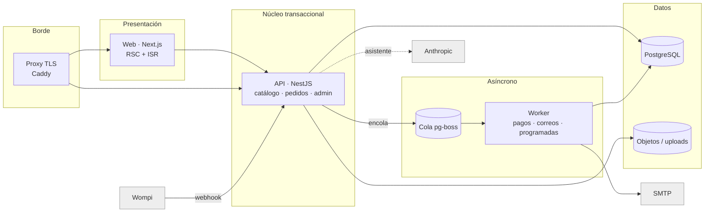

# Análisis de microservicios · Pimentones La Cajita

## La pregunta correcta

El objetivo no es "tener microservicios" sino **que una falla afecte lo menos posible**: que una caída del correo no impida vender, que un pico del asistente no tumbe el checkout, que un despliegue de la web no toque los pagos. Eso se logra separando por **dominios de falla** y por **patrones de carga**, no por tablas o por capas técnicas.

Con el volumen actual (cuatro productos, decenas de pedidos al día) una malla de ocho servicios con su propia base de datos cada uno **aumentaría** el riesgo: más red, más despliegues, más puntos donde perder un pedido. La estrategia recomendada es un **monolito modular con límites explícitos**, desplegado en **varios procesos que aíslan los dominios de falla**, y una ruta clara para extraer servicios cuando la carga lo justifique.

## Mapa de dominios y qué pasa si cada uno falla

| Dominio | Responsabilidad | Si falla | Patrón de carga | Debe estar aislado |
|---|---|---|---|---|
| **Catálogo** | productos, precios, inventario, ajustes | no se puede comprar | lectura masiva, cambia poco | sí: se sirve desde páginas estáticas regeneradas (ISR) |
| **Pedidos** | crear pedido, reservar inventario, estados | no se puede comprar | escritura transaccional | núcleo; debe ser lo más simple y protegido |
| **Pagos** | firma Wompi, eventos de pago | pedidos quedan en pendiente | ráfagas de webhooks, reintentos | sí: el webhook solo encola; el worker aplica |
| **Notificaciones** | correos al cliente y al negocio | nadie se entera, pero la venta ocurrió | lento, depende de un tercero (SMTP) | sí: siempre asíncrono y con reintentos |
| **Asistente** | recomendaciones con IA | la sección muestra reglas locales | latencia alta, costo por uso, tercero (Anthropic) | sí: con degradación automática |
| **Medios** | fotos de productos | fichas sin foto nueva | poco frecuente | sí: almacenamiento de objetos, no disco local |
| **Administración** | panel, autenticación, reportes | el negocio no gestiona, los clientes sí compran | poca carga, usuarios internos | sí: rutas separadas y límites propios |
| **Programadas** | expirar pedidos, limpiar | inventario retenido más tiempo | cron | sí: una sola ejecución garantizada |

## Diseño objetivo

### Qué se separa hoy (ya implementado en este repositorio)

1. **Web** (Next.js) como proceso propio. Sirve catálogo y fichas **pregenerados**: si la API cae, las páginas siguen respondiendo desde la última regeneración y solo falla el botón de comprar.
2. **API de borde** (NestJS): catálogo, pedidos, admin, asistente. Es el único proceso con HTTP público además de la web. Rutas sensibles con límites de peticiones propios.
3. **Worker**: misma imagen que la API, otro comando (`node dist/worker.js`). Procesa **eventos de pago, correos y tareas programadas** desde una cola en PostgreSQL (`pg-boss`), con reintentos exponenciales y una sola ejecución de las tareas programadas aunque haya varias réplicas. El webhook de Wompi responde en milisegundos: verifica la firma, encola y listo.
4. **Cola sobre PostgreSQL, no Redis**: una pieza menos que operar, respaldar y vigilar. Cuando el volumen supere miles de trabajos por minuto, cambiar a BullMQ/Redis es un cambio local en `JobsService`.
5. **Asistente con degradación**: si Anthropic no responde en 8 s o no hay llave, responde con reglas locales. Nunca deja la sección caída ni bloquea la compra.
6. **Modo un solo contenedor** (`JOBS_INLINE=true`): la API procesa sus propios trabajos. Para entornos pequeños o de prueba. La separación se activa con una variable, sin tocar código.

### Qué no se separa todavía, y por qué

- **Catálogo y pedidos en el mismo proceso y la misma base de datos.** Reservar inventario al crear un pedido necesita una transacción atómica. Separarlos obligaría a sagas y compensaciones para resolver un problema que hoy no existe. Se separan cuando el catálogo tenga su propio ciclo de vida (cientos de productos, otro equipo, otra frecuencia de despliegue).
- **Administración dentro de la API.** Comparte el modelo de pedidos. Vive en su módulo, con su guard y sus límites. Extraerla es mover un directorio.

## Ruta de extracción (cuando la carga lo pida)

| Fase | Disparador | Qué se extrae | Cómo | Riesgo que elimina |
|---|---|---|---|---|
| **0 · hoy** | — | web / api / worker / db / proxy / backup | Docker Compose, una imagen por app | correo, pagos y cron ya no afectan el checkout |
| **1** | >1 réplica de API o colas largas | **Worker escalado aparte** (2+ réplicas) y **Redis + BullMQ** | `JobsService` cambia de adaptador | ráfagas de webhooks y correos |
| **2** | fotos en varios servidores o CDN | **Medios** a almacenamiento de objetos (Azure Blob / S3) | `admin/upload` sube al bucket; la web lee del CDN | pérdida de archivos en disco, escalado horizontal |
| **3** | catálogo con cientos de productos o equipo propio | **Catálogo** como servicio con lectura propia (réplica o caché) | eventos `product.updated`; pedidos siguen validando precio contra el servicio | despliegues del catálogo no tocan pedidos |
| **4** | varios canales de venta (app, marketplace, POS) | **Pedidos** como servicio con API de dominio y outbox de eventos | contratos en `packages/shared`; outbox → cola | un canal roto no afecta a los demás |
| **5** | varios administradores con roles | **Identidad** (usuarios, roles, auditoría) | tabla de usuarios + hash; o proveedor externo (Entra ID) | credenciales únicas en entorno |

Cada fase es independiente y reversible. Nada obliga a hacer la siguiente.

## Reglas para que la separación no rompa nada

- **Un dueño por dato.** Quien escribe una tabla es un solo módulo. Los demás leen por API o por eventos.
- **Contratos en un solo lugar.** `packages/shared` tiene los esquemas Zod; cambiar un campo rompe la compilación en los dos lados antes de llegar a producción.
- **Todo lo asíncrono es idempotente.** Los trabajos llevan llave única y las transiciones de estado comprueban el estado anterior; un reintento o un evento duplicado no hace daño (ya probado con el webhook de Wompi).
- **Degradar, no caer.** Páginas estáticas si la API falla; reglas locales si la IA falla; cola si el correo falla; pago en línea oculto si no hay llaves de Wompi.
- **Salud y límites por proceso.** `/api/health`, `/health` del worker, límites de memoria en Compose, reinicio automático.
- **Despliegue por partes.** `scripts/deploy.sh` actualiza API, luego worker y web; `rollback.sh` vuelve a cualquier tag anterior.

## Costo de operación estimado

| Fase 0 (hoy) | Fase 1–2 | Fase 3+ |
|---|---|---|
| 1 VM pequeña o 1 nodo (2 vCPU / 4 GB) con Compose, o Azure Container Apps con 3 apps | + Redis gestionado, + almacenamiento de objetos | + servicios y bases separadas; conviene Kubernetes (AKS) y un equipo que lo opere |

La fase 0 ya cumple el objetivo pedido: una falla de correos, pagos externos, IA o tareas programadas **no impide vender**, y un despliegue de la web **no toca** la API ni los pagos.
